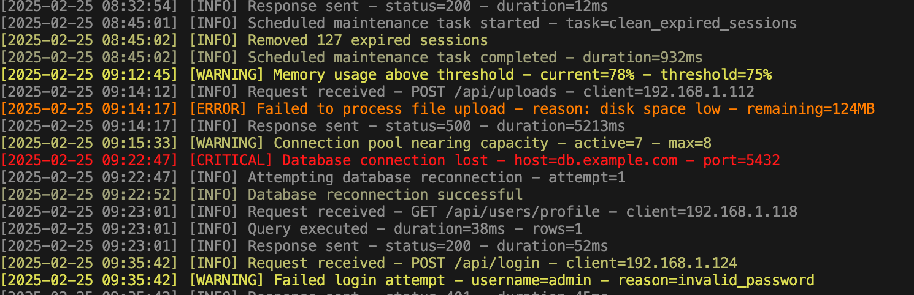

# llmog - LLM Log Analyzer

An experimental tool that uses large language models to automatically highlight log files based on the significance of each entry.



The tool processes each log entry through a pre-trained language model, which rates its importance on a scale from 0 to 100. This rating is then used to generate a color-coded output, making it easier to identify critical log entries at a glance.

Very much a prototype. This tool uses the `jnises/gemma-3-1b-llmog-GGUF` (Q8_0 GGUF) model for analysis via `mistral.rs`. The system prompt is designed for this model. Performance depends on your hardware.
If you give it something other than a log-file the model has a tendency to get quite confused. This tool uses `mistral.rs` for local model inference.

## Prerequisites

- [Rust toolchain](https://rustup.rs/)
- An internet connection is required on the first run to download the pre-configured model (`jnises/gemma-3-1b-llmog-GGUF` Q8_0) from Hugging Face Hub.

## Installation

```bash
cargo install --path .
```

Or install directly using:
```bash
cargo install --git https://github.com/jnises/llmog
```

## Usage

Pipe your logs into llmog:

```bash
tail -f your.log | llmog
```

### Options

- `--analyze`: Show analysis after each log line
- `--gguf-log-level <LEVEL>`: Optional. Sets the log level for the GGUF loader in `mistral.rs` (e.g., 'trace', 'debug', 'info', 'warn', 'error', 'silence'). Default: 'silence'.
- `--model-cache-dir <PATH>`: Optional. Specifies a custom directory for storing downloaded Hugging Face models. Defaults to the standard Hugging Face cache directory.
- `--context=N`: Number of lines to use for context (default: 3)
- `--timeout=SECONDS`: Request timeout in seconds (default: 10). This applies to individual model inference requests. The initial download of the pre-configured model may also take longer (uses this timeout x3 internally for download operations).

Note that you need a terminal with true color ansi support for this to be useful.

## TODO

- Finetune using non-log files to make sure the model doesn't get confused.
